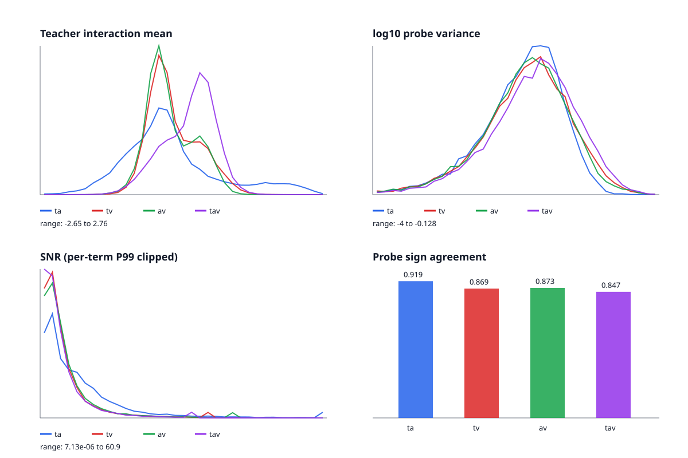

# 三 Probe 教师交互可靠性统计

样本数：18197；Probe 数：3。

| 交互 | Mean | Std | Median | Mean abs(mu) | Mean variance | P90 variance | Sign agreement | Mean SNR | Median SNR |
|---|---:|---:|---:|---:|---:|---:|---:|---:|---:|
| ta | -0.1789 | 0.9235 | -0.3282 | 0.7401 | 0.0186 | 0.0425 | 0.919 | 9.188 | 5.547 |
| tv | -0.1354 | 0.4713 | -0.2482 | 0.4201 | 0.0259 | 0.0616 | 0.869 | 5.315 | 3.238 |
| av | -0.1887 | 0.4470 | -0.2961 | 0.4234 | 0.0244 | 0.0560 | 0.873 | 5.616 | 3.490 |
| tav | 0.1672 | 0.4875 | 0.2565 | 0.4361 | 0.0316 | 0.0771 | 0.847 | 4.916 | 3.018 |

## 噪声诊断

- Pair 平均 Probe 方差：0.0230
- Triple 平均 Probe 方差：0.0316
- Triple / Pair 方差比：1.378
- Triple 方差高于每个 pair：True

