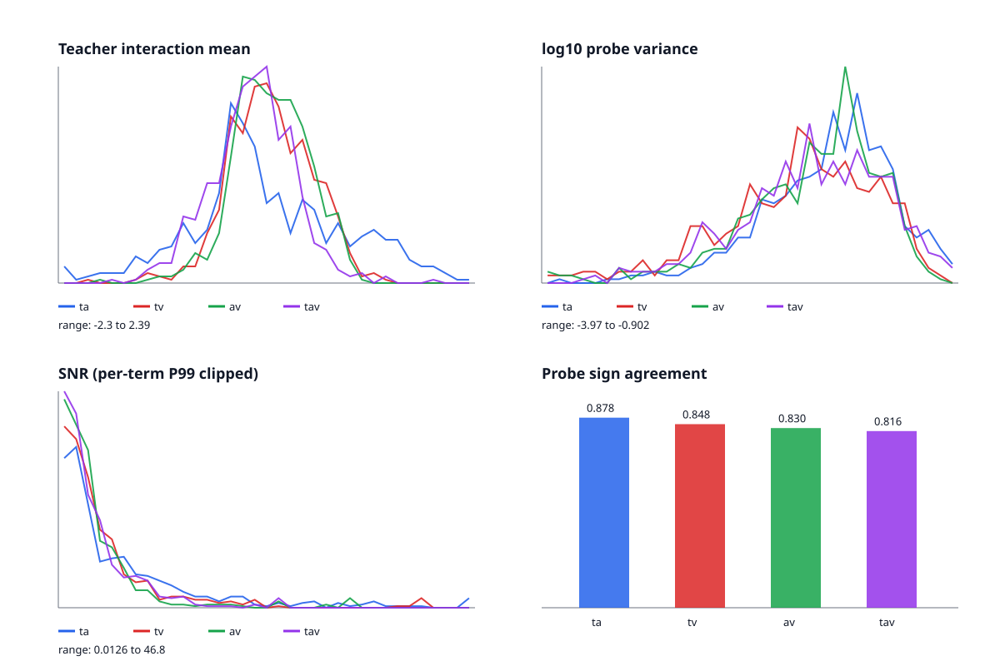

# 三 Probe 教师交互可靠性统计

样本数：500；Probe 数：3。

| 交互 | Mean | Std | Median | Mean abs(mu) | Mean variance | P90 variance | Sign agreement | Mean SNR | Median SNR |
|---|---:|---:|---:|---:|---:|---:|---:|---:|---:|
| ta | 0.0561 | 0.8653 | -0.0865 | 0.6773 | 0.0222 | 0.0471 | 0.878 | 7.614 | 3.673 |
| tv | 0.0938 | 0.4683 | 0.0908 | 0.3755 | 0.0155 | 0.0391 | 0.848 | 5.263 | 3.080 |
| av | 0.0956 | 0.4217 | 0.0919 | 0.3441 | 0.0168 | 0.0383 | 0.830 | 4.686 | 2.729 |
| tav | -0.1153 | 0.4678 | -0.1040 | 0.3720 | 0.0190 | 0.0450 | 0.816 | 4.152 | 2.619 |

## 噪声诊断

- Pair 平均 Probe 方差：0.0182
- Triple 平均 Probe 方差：0.0190
- Triple / Pair 方差比：1.046
- Triple 方差高于每个 pair：False

